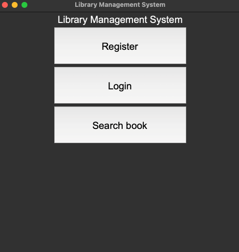
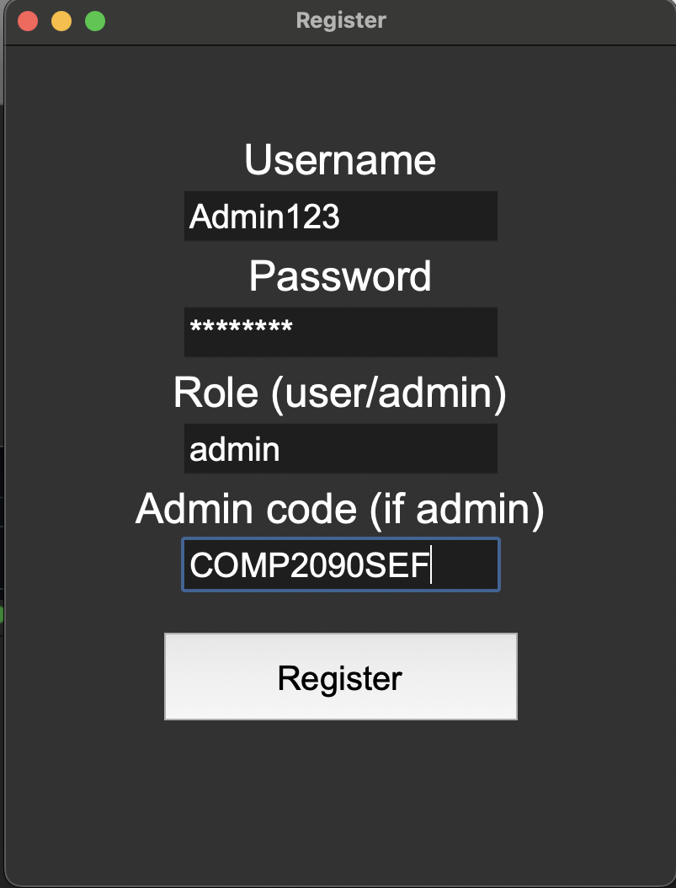
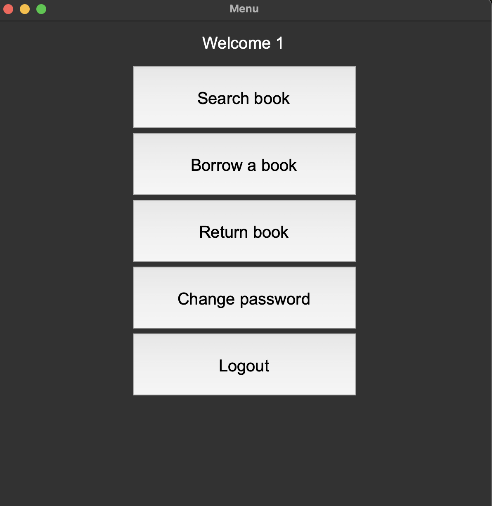
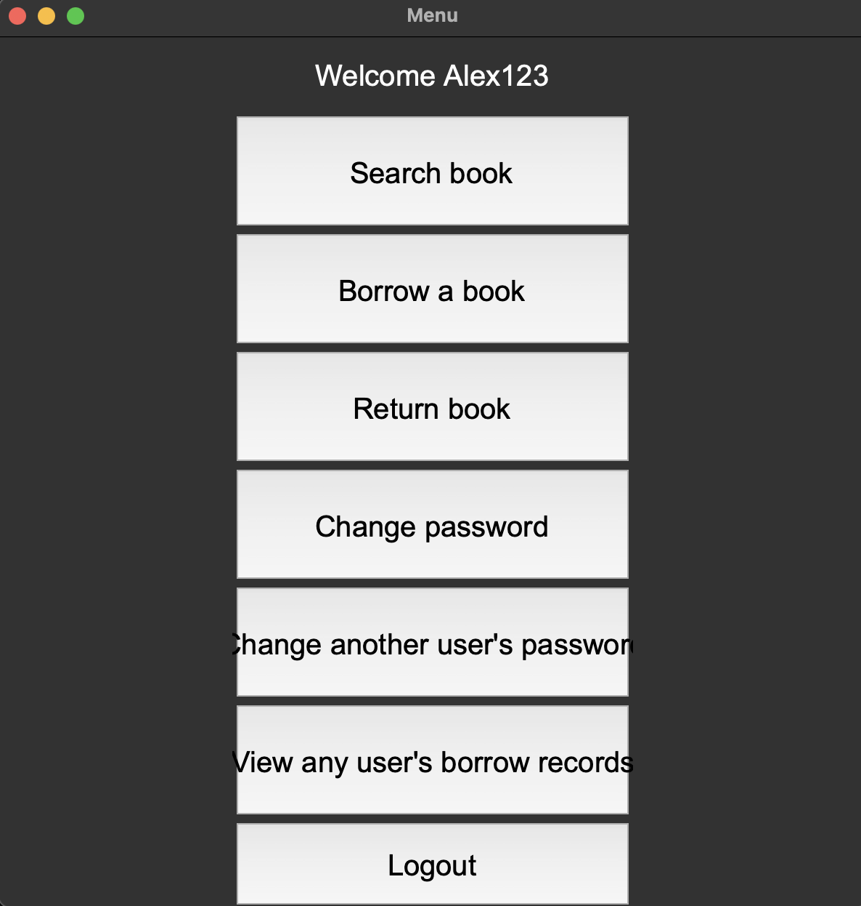
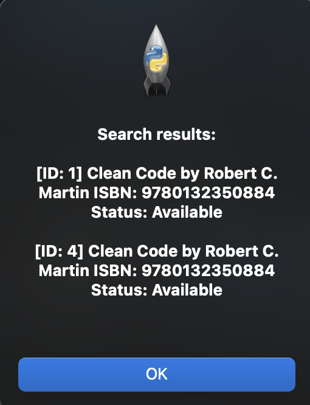

# Library Management System


## Contents
- [System Overview](#overview)
- [Core functions](#coreFunctions)
- [User roles](#roles)
- [Modules](#modules)
- [Installation](#installation)
- [User guide](#userGuide)
- [Screenshots](#screenshots)

## <a name="overview">System Overview</a>
It is a Tkinter-based Python application built with Object-Oriented Programming principles, serving as a comprehensive Library Management System.

## <a name="coreFunctions">Core Functions</a>
**User Management**
- Account registration
- Login/Logout
- Change password
- Admin: Change other user's username/password

**Book Management**
- Search for books by title/author/ISBN
- View book availability status

**Borrowing system and Records Management**
- Borrow available books
- Return borrowed books with automatic fine calculation
- Automatic fine calculation for overdue returns ($1.5/day, max $130)
- View borrowed books when returning
- Admin: View any user's borrowing records

## <a name="roles">User roles</a>
**Normal User:**
- Register/login
- Search books
- Borrow/Return books
- View own borrowing records when returning
- Change own password

**Admin:**
- All Normal User functions
- Change other user's username/password
- View any user's borrowing records
- ***Note: Admin registration requires special admin code*** 

## <a name="modules">Modules</a>
| Module | Description |
|--------|-------------|
| `main.py` | Entry point and Tkinter GUI interface |
| `user.py` | Manage user accounts, include registration, login, password and role |
| `book.py` | Manage book data, include title, author, ISBN, availability|
| `library.py` | Core business logic of the library, such as borrowing, returning, overdue fines |

## <a name="installation">Installation</a>

### Prerequisites
- Python 3.0 or higher
- Standard library only (no extra installation needed)

### Steps
1. **Download or Copy all Python files into the same folder:**
- `main.py`
- `library.py`
- `user.py`
- `book.py`

2. **Run the application**
```
python main.py
```

## <a name="userGuide">User Guide</a>

### First Time Use

1. Launch the application by executing `python main.py`
2. You will see the main menu with three options: **Register**, **Login**, **Search Book**

> **Note:** The **Search Book** function is always available — you can use it before or after login.
| Interface | Screenshot |
|-----------|------------|
| Main Menu |  |
---

### 1. Registration

1. Click **Register**
2. Enter:
   - Username
   - Password
   - Role (type `user` or `admin`)
   - Admin code (if registering as admin): `COMP2090SEF`
3. Click **Register**

---

### 2. Login

1. Click **Login**
2. Enter your username and password
3. After successful login, the main menu will appear

---

### 3. Searching for Books (No login required)

1. Click **Search book** from the main menu
2. Enter a keyword (Title / Author / ISBN)
3. Results will show all matching books

---

### Main Menu: Normal User

#### 4. Borrowing a Book

1. Click **Borrow a book**
2. Enter the ISBN of the book you want to borrow
3. If the book is available, it will be borrowed with a 14-day due date

#### 5. Returning a Book

1. Click **Return book**
2. You will see a list of your borrowed books with their Book IDs (e.g., `1. Clean Code` — `1` is the Book ID)
3. Enter the Book ID you want to return
4. Any overdue fine will be calculated and displayed

#### 6. Changing Your Password

1. Click **Change password**
2. Enter your current password
3. Enter your new password

---

### Main Menu: Admin

After logging in as an admin, two additional buttons will appear:

#### 7. Change Another User's Password

1. Click **Change another user's password**
2. Enter the username of the account you want to change
3. Enter that user's current password
4. Enter the new password

#### 8. View Any User's Borrow Records

1. Click **View any user's borrow records**
2. Enter the username of the account you want to check
3. The system will show all books currently borrowed by that user


## <a name="screenshots">Screenshots</a>

| Interface | Screenshot |
|-----------|------------|
| Main Menu |  |
| Registration |  |
| Normal User Menu |  |
| Admin Menu |  |
| Search Results |  |
